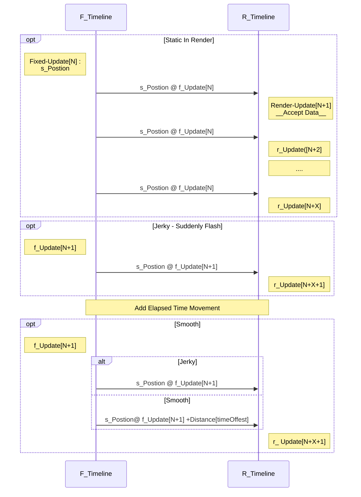

---
title: EAE 6320 Engineering II -  05 Camera, Rigid-body, Transforms, GameObject
date: 2018-09-24 14:07:00
tags: 
- Entertainment Arts Engineering 
- Graphics
- C++
- Camera
- Transforms
categories: 
- Engineering
- EAE 6320
thumbnail: https://chenmi-ink-1252570167.cos.na-siliconvalley.myqcloud.com/AssignFiveBanner.jpg
toc: true
---


For now, we draw meshes in *[Screen Space]*, in which case we need to calculate each vertex position in a union form range. This is not the way a real game engine deal with dds files. We need add one or more observers into the engine, usually it is camera. To implement:

<!--more--> 

## Points 
1. We need handle the transforms between different spaces to project objects in *[World Space]* in to *[Screen Space]* just like an observer (camera) sees.

2. Rather than calculating each vertex position in world space, we regard a model (set of vertices) as a united object that has its position in *[World Space]*. This is related to *[Model Space]* to *[World Space]* and put meshes and transforms into certain kind of class.

3. Smooth movement control of objects and camera using extrapolate time to reduce "jerky" movement.


***
> Click [Download](https://chenmi-ink-1252570167.cos.na-siliconvalley.myqcloud.com/EAE6320Zip/AssignFiveMyGame_.zip) the game.

***


# Process


## Physics

I use John-Paul's <code>Physics Project</code> implement the rigid-body movement. The tricky thing is to decide where to put <code>sRigidBodyState::Update</code>. Like in Unity, the physics related calculation should be called in <code>FixedUpdate</code> which has united time steps. 

In this project, we set the "logic/fixed/stimulation" timeline as 15 frames and no limits for "rendering/graphics" timeline.

---
## Updates

- **Extrapolation is Necessary**

Right now, two timelines are in application. One is behaved like <code>FixedUpdate()</code> in Unity, One is  behaved like <code>Update()</code> in Unity. 

We cannot guarantee these two functions are always been called in the same time. More often render frames are more than logic frames. The render updates run faster (more calls) than fixed updates. So, each **render update calls** would use the same position stored in last **physic update calls**. In this case, the render position doesn't match what player supposed if the entity is moving.


Therefore, we need to submit some future rigid-body information (relatively to "**FixedUpdate**" calls) before drawing.

---

- **Timeline Chart**

Although the time goes, the render pipeline always uses old position and when next fixed update happens, it will change the position suddenly. The Diagram shows two timelines for updates. 




 
> [Fixed Update] 15 calls per second. 
---

## cGameObject 

I create a <code>cGameobject</code> class as representation of entity in the engine. The interface is below:
```C++
class cGameObject
{
  public:
	cGameObject();
	~cGameObject();
	
	Physics::sRigidBodyState _rigid_body_state;
	cMesh* m_mesh_instance;
	cEffect* m_effect_instance;
	bool isVisable = true;
	
	// Functions
	void LoadRenderInfo(cMesh* meshRef,cEffect* effectRef);
		//...... 
};

```
The <code>cMesh</code> pointer, <code>cEffect</code> pointer works as graphic render property, and <code>sRigidBodyState</code> works as physics property. In this way, the gameobject could track its "Look" and "Body". It may have more status like <code>"visible"</code> in the future.


After having <code>cGameObject</code>, It is <code>cGameObject's</code> responsibility to submit render data to graphic render thread.

like below:

```C++
void SubmitMeshWithEffect(const float i_secondCountToExtrapolate);
```
Since it already has meshs and effects, the only parameter is time offset between "**Update**" and "**FixedUpdate**" calls, which is used to calculate current render position. Within it:

```C++
void Graphics::SubmitMeshEffectPairs(cMesh *meshInstance, 
		cEffect *effectInstance,
		Math::cQuaternion rotation,Math::sVector position)
```

***


## cMeshPrefab

Besides, I also make a <code>cMeshPrefab</code> class to save vertices and index data. By adding this, the flow works more like loading a model data to instantiate meshes and pass instances to entities. 

In this way, the <code>cGameobject</code> would only modify its own mesh like scale or morph and keep original data clean.

- **To initialize, <code>LoadExternalData</code> :**

```C++
cMeshPrefab::LoadExternalData(
std::vector<VertexFormats::sMesh> vertice,
std::vector<uint16_t> indexArray)
```

- **To create mesh instance form a prefab and assign to gameobject**:

```C++
result = Graphics::cMesh::MeshFactory(s_Pyramid_Mesh.GetMeshData(),
s_Pyramid_Mesh.GetIndexData(), s_mesh_instance2);
```
---


## sPerDrawCall 

For each meshes, it has a perDrawcall buffer used as passing data from CPU to GPU.

The <code>sPerDrawCall</code> buffer has a <code>g_transform_localToWorld</code> transform. To calculate it, I pass a<code>cQuaternion</code> (4 floats) and a <code>sVector</code> (3 floats). Totally, the graphics only need to know 7 floats for each gameobject per drawcall .


- **Size of Drawcall**

Platform | Size 
---|---
DirecX | 16+12 -> 28
OpenGL | 16+12 -> 28


***

# Thoughts & Discussion

- I decide not to add a *Transform* class to <code>cGameObject</code> this time since <code>sRigidBodyState</code> has position and quaternion, which are smaller than a matrix. Another reason is that, right now, we only need to calculate the matrix per draw call once in graphic.

- I think it's hard to determine the balance between time and memory size in game engine because the lack of enough experience and use cases. In game development, we are more likely to sacrifice more memory (reasonable) to reduce waiting time. 


***

# Personalize

## Controls

Hold **[SPACE]** key to slow down the color animation. 

Hold **[Shift]** key to hide the square in the center.

Hold **[Ctrl]** key to change four triangles color.

Press **[↑, ↓, ←, →]** keys to move around camera. 

Press **[Q],[E],[Z],[C]** keys to rotate camera left, right, up and down.

Press **[A],[S],[D],[W]** keys to move around default gameobject.

Press **[1],[2]** keys to switch default gameobject's mesh. 
- **[1]** -> Square; **[2]** -> Pyramid

***

## Screen Shots

Keys show on the left corner with input count.

- **Movement**


***

- **Change Mesh**


***
## Implementation 

- **cCamera**

To allow camera move along it's facing axes, we have to get camera's directions. It's better to let cCamera caches a cMatrix_transformation which updates in "**FixedUpdate**" in <code>UpdateRigidbody</code>. 

```C++
public:
 void SubmitCameraInfo(const float i_elapsedSecond_sinceLastUpdate);
 void UpdateRigidbody(const float i_elapsedSecond_sinceLastUpdate);

 Physics::sRigidBodyState s_rigid_body_state;  
 Math::cMatrix_transformation s_transformation;
//Camera Configs - FOV
//.....
private:
 void UpdateMatrix();
```

- **Shader**

With different mesh's "local-position.z" value, I assign different values to "blue channel”. So in Pyramid mesh, there is section in different color. We pass "local-vertex-position" from Vertex shader to Fragment shader. Then in Fragment shader:

In D3D:

```C++
in const float3 o_position : POSITION,
//...
if(o_position.z<0) bVal=0;
//...
```
In OpenGL:

```C++
in float depthZ;
//...
if(depthZ<0) bVal=0;
//...
```

***
- **Camera Movement**


***


# Download

> Click [Download](https://chenmi-ink-1252570167.cos.na-siliconvalley.myqcloud.com/EAE6320Zip/AssignFiveMyGame_.zip) the game.

Version: x64 - DirectX.
